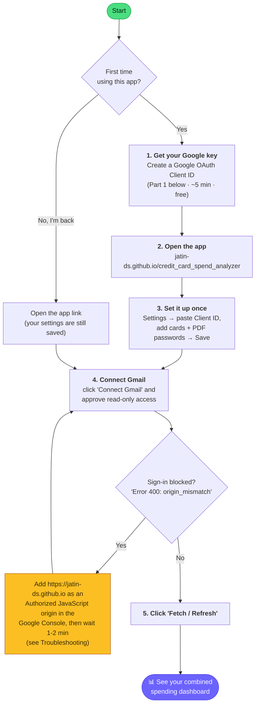

# Credit Card Spend Analyzer

A **100% free, fully local, browser-only** tool that pulls your credit‑card
statement PDFs straight from Gmail, opens the password‑protected files, extracts
every transaction, and shows you a combined view of your spending across all of
your cards.

Everything runs **inside your browser tab**. No server, no backend, no upload.
The PDFs are parsed in‑browser with Python (via [Pyodide](https://pyodide.org/) +
[`pdfminer.six`](https://github.com/pdfminer/pdfminer.six)), and the only network
calls the page makes are the normal authenticated requests to **your own** Gmail.

---

## ▶️ Open the app

### Option 1 — Hosted (recommended, nothing to install)

Just open and bookmark this permanent link:

### 👉 **https://jatin-ds.github.io/credit_card_spend_analyzer/**

No terminal, no download, no local server — it works from any browser, on any
computer, and your settings stay saved in that browser. Do the **one‑time Google
OAuth setup** ([Part 1](#part-1--create-a-google-oauth-client-id-free-5-min-no-billing))
once, making sure to add `https://jatin-ds.github.io` as an Authorized JavaScript
origin on your Client ID.

### Option 2 — Run locally / offline

Prefer to run it on your own machine? See
**[Part 2 — Run locally](#part-2--run-locally-option-2)**.

> **Does this link work only for me?** The page is public, but it stores **no
> data and no Client ID** — everything lives only in *your* browser's
> `localStorage`. So it works for you because your browser already has your
> Client ID + cards saved. **Any new user** can open the same link and use it
> too, but they must enter **their own** Google OAuth Client ID (see Part 1) —
> the app then reads *their* Gmail. Two people never share data or credentials.

---

## 🗺️ How to use it — at a glance

In plain words, you do this **once**: get a free "key" from Google (the Client
ID) so the app is allowed to read your Gmail, paste it into the app, add your
cards and their PDF passwords, and connect Gmail. After that, **every month you
just open the link and click Fetch** — no passwords to type again.



> Steps 1–3 happen **only the first time**. From then on, returning is just:
> **open the link → Connect Gmail → Fetch**.

---

## What it does

1. **Fetches** your statement emails from Gmail for each card you configure.
   Every search is hard‑restricted to emails that carry a **PDF attachment**.
2. **Decrypts** each password‑protected statement PDF with the password you save
   locally.
3. **Extracts** the statement summary (total due, minimum due, due date, billing
   period) and the full transaction table using a per‑bank Python parser.
4. **Disambiguates** cards that share a sender/subject by reading the masked card
   number and matching the **last 4 digits** you configured.
5. **Visualizes** combined spending: KPI cards (total due, total spent,
   statements analysed), a *Spent by card* chart, a *Spend over time* trend, and
   an expandable month → card → transactions breakdown.

### Privacy & cost

- **Free forever.** The Gmail API is free for personal use; Pyodide,
  `pdfminer.six`, and Chart.js are open source. **No credit card** is needed on
  your Google account.
- **Private by design.** Statement PDFs and their contents never leave your
  browser's memory. Your OAuth Client ID, card passwords, and settings are stored
  only in this browser's `localStorage`, on your machine.

---

## Supported banks

> ⚠️ Dedicated statement‑extraction logic currently exists for **only these
> banks**:

| Bank | Extraction |
|------|------------|
| **HDFC** | ✅ Dedicated parser |
| **ICICI** | ✅ Dedicated parser |
| **AXIS** | ✅ Dedicated parser |
| Any other bank | ⚠️ Not supported yet |

> **Important:** For banks other than HDFC, ICICI, and Axis, fetching and parsing
> **may not work properly** — totals, due dates, or transactions can be misread
> or missed entirely, because the statement layout hasn't been programmed in.
> To use another bank reliably, you must **add its extraction logic to the
> backend code** first — see
> **[Adding a new bank (extraction logic)](#adding-a-new-bank-extraction-logic)**
> below.

---

## Quick start (new user)

The only one‑time setup is creating a Google OAuth Client ID so the app can read
*your* Gmail with your permission. The in‑app **How to** tab walks through the
same steps if you prefer to follow along in the UI.

### Part 1 — Create a Google OAuth Client ID (free, ~5 min, no billing)

1. Go to <https://console.cloud.google.com> and sign in.
2. **Create a project**: project dropdown (top bar) → **New Project** → name it
   (e.g. `spend-analyzer`) → **Create**.
3. **Enable the Gmail API**: search bar → "Gmail API" → **Enable**
   (or *APIs & Services → Library → Gmail API → Enable*).
4. **Configure the consent screen**: *APIs & Services → OAuth consent screen*
   - User type: **External** → Create
   - Fill the app name + your email in the required fields → Save and Continue
   - **Scopes**: add `https://www.googleapis.com/auth/gmail.readonly` → Save
   - **Test users**: add your own Gmail address → Save
   - Leave the app in **Testing** mode (no Google verification needed).
5. **Create the credential**: open
   **<https://console.cloud.google.com/apis/credentials>** → **Create
   Credentials → OAuth client ID**
   - Application type: **Web application**
   - **Authorized JavaScript origins** → click **Add URI** → add
     `https://jatin-ds.github.io` (for the hosted app). If you'll also run it
     locally, **Add URI** again with `http://localhost:8000`.
   - **Create**, then copy the **Client ID** (looks like
     `1234567890-abcd.apps.googleusercontent.com`). No client secret is needed.
6. Open the app, go to **Settings**, paste the Client ID, and **Save settings**.

> None of these steps ask for a credit card. Billing is only required for paid
> Google Cloud products, which this app does not use.

#### 🔑 Already created your Client ID? Find it again

You don't create a new one each time. To copy your existing Client ID later:

1. Open **<https://console.cloud.google.com/apis/credentials>** (sign in with the
   same Google account; pick the right project in the top‑bar dropdown).
2. Under **OAuth 2.0 Client IDs**, click your client's name.
3. Copy the **Client ID** shown on the right → paste it into the app's
   **Settings**.

### Part 2 — Run locally (Option 2)

You don't need this if you use the **hosted URL** above. But to run it on your
own machine (offline), OAuth requires a registered origin, so serve it over
`http://localhost:8000` (not as a `file://` page):

```bash
# from the project folder
python3 -m http.server 8000
```

Then open <http://localhost:8000> in your browser. The first load shows a brief
progress bar while the Python runtime initialises.

### Part 3 — Configure your cards

Open the **Settings** tab and:

1. Paste your **Google OAuth Client ID**.
2. Pick **Statements per card** — how many of the most recent statements to fetch
   for each card.
3. Set the **Look‑back (months)** window — statements older than this are never
   fetched (default **6**).
4. Fill the **Cards** table (one row per physical card):

   | Field | What to enter |
   |-------|----------------|
   | **Label** | Any name you like, e.g. `Amazon Pay ICICI`. |
   | **Last 4 digits** | The card's last 4 digits (optional). If set, only statements whose PDF ends in these digits are attributed to this card — this disambiguates multiple cards from the same bank/sender. |
   | **Bank** | The issuer: HDFC, ICICI, or AXIS. |
   | **Sender email match** | *(toggle)* Match emails from a sender address, e.g. `cc.statements@axisbank.com`. Turn on **Multiple senders** if a card's statements arrive from different addresses across months (one address per line). |
   | **Subject match** | *(toggle)* Match emails whose subject contains a phrase, e.g. `ICICI Bank Credit Card Statement for the period`. |
   | **PDF password** | The password your bank uses to encrypt the statement PDF. |

   You can enable **sender match**, **subject match**, or **both** — at least one
   is required. Regardless of what you pick, the app always restricts results to
   emails that have a **PDF attachment**, so a single good filter is usually
   enough. Use **+ Add card** / the **×** button to add or remove rows, then click
   **Save settings** (you'll see a green ✓ Saved).

5. Click **Connect Gmail** and approve the read‑only access. You'll see an
   "unverified app" notice because the app is in Testing mode — that's expected;
   continue.
6. Click **Fetch / Refresh**. For each card the app finds the matching statement
   emails, decrypts and parses the PDFs, and renders the combined dashboard.

The **Activity log** at the bottom shows exactly what happened per card
(candidates found, statements kept, totals parsed, and any errors such as a
wrong password).

---

## Troubleshooting

### "Access blocked: Authorization Error" / `Error 400: origin_mismatch`

This means the URL you opened the app from isn't listed as an **Authorized
JavaScript origin** on your Client ID. Fix it once:

1. Open **<https://console.cloud.google.com/apis/credentials>** and select the
   project that owns your Client ID.
2. Under **OAuth 2.0 Client IDs**, click your client's name to edit it.
3. Under **Authorized JavaScript origins** → **Add URI**, add the **exact**
   origin (scheme + host, **no path, no trailing slash**):
   - Hosted app: `https://jatin-ds.github.io`
   - Local use: `http://localhost:8000`
4. **Save**, wait ~1–2 minutes, then hard‑refresh the app (Cmd/Ctrl+Shift+R) and
   click **Connect Gmail** again.

> Make sure you edit the **same** Client ID that's saved in the app's Settings,
> and that you put the value under *JavaScript origins* — not *redirect URIs*.

### "This app isn't verified" / Access blocked for a test user

Your Gmail address must be listed as a **Test user** on the consent screen
(*APIs & Services → OAuth consent screen → Test users*). Add it, then retry.

---

## Project structure

| File | Purpose |
|------|---------|
| `index.html` | UI layout + styling; loads the CDN libraries (Pyodide, Chart.js, Google Identity Services). |
| `app.js` | OAuth, Gmail search/fetch, Pyodide bootstrap, fetch orchestration, and all rendering. |
| `config.js` | `localStorage`‑backed settings (Client ID, cards, look‑back, count) and supported‑bank list. |
| `charts.js` | Chart.js dashboards + merchant → category helpers + INR formatting. |
| `py/pipeline.py` | Opens and text‑extracts PDFs with `pdfminer.six`; pulls the masked card last‑4. |
| `py/parsers.py` | Per‑bank parsers returning a normalized statement summary + transaction list. |

---

## Adding a new bank (extraction logic)

Only **HDFC, ICICI, and Axis** have dedicated extraction logic today (see
[Supported banks](#supported-banks)). To make another bank work reliably you
must add a parser for it in the backend code (`py/parsers.py`) and list the bank
in the dropdown. Here's the full process:

1. **Get a sample statement's raw text.** In the app, add the card with the
   nearest bank selected and click **Fetch** once. Open your browser's DevTools
   **Console** — the app prints the full extracted text of each statement under a
   block labelled `RAW EXTRACTED TEXT`. Copy that text for one statement.
2. **Write the parser** in `py/parsers.py`. Add a `parse_<bank>(extracted,
   card_label)` function (use the existing `parse_hdfc` / `parse_icici` as
   references) that returns the **normalized shapes** below, then register it in
   the parser registry so dispatch picks it up:

   ```python
   # one transaction
   {"date": "YYYY-MM-DD", "merchant": str, "amount": float,
    "type": "debit" | "credit", "card": label}

   # statement summary
   {"card": label, "bank": str, "totalDue": float | None,
    "minDue": float | None, "dueDate": "YYYY-MM-DD" | None,
    "statementPeriod": str | None}
   ```
3. **Add the bank to the dropdown.** Add the bank's uppercase code to
   `SUPPORTED_BANKS` in `config.js` (e.g. `["HDFC", "ICICI", "AXIS", "SBI"]`).
4. **Reload** the app. Dispatch is by the card's **Bank** field, so the new bank
   now uses your parser — no other files need changing.

> 💡 **Easiest path:** open this project in an AI coding editor (e.g. Cursor) and
> ask it: *"Add an extraction parser for &lt;BANK&gt; credit card statements in
> `py/parsers.py`. Here is the raw extracted statement text: &lt;paste&gt;.
> Follow the same normalized output shape as `parse_icici` / `parse_hdfc`,
> register it, and add &lt;BANK&gt; to `SUPPORTED_BANKS` in `config.js`."*
> The in‑app **How to** tab contains this same guide.

---

## Limitations

- Works on **text‑based** statement PDFs (the normal kind). Scanned/image‑only
  PDFs are not supported (no OCR in this build).
- The generic parser is a starting point; per‑bank tuning against your real
  statements gives the best accuracy.
- If a bank changes its statement template, its parser may need a quick update.

---

## Tech stack

- Vanilla HTML/CSS/JS — no build step, no framework.
- [Pyodide](https://pyodide.org/) (CPython in WebAssembly) +
  [`pdfminer.six`](https://github.com/pdfminer/pdfminer.six) for in‑browser PDF parsing.
- [Chart.js](https://www.chartjs.org/) for charts.
- [Google Identity Services](https://developers.google.com/identity) + Gmail API
  (read‑only) for fetching statements.
